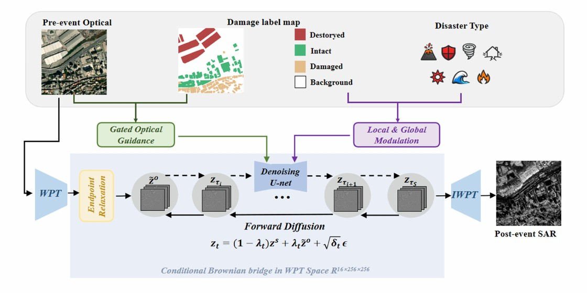
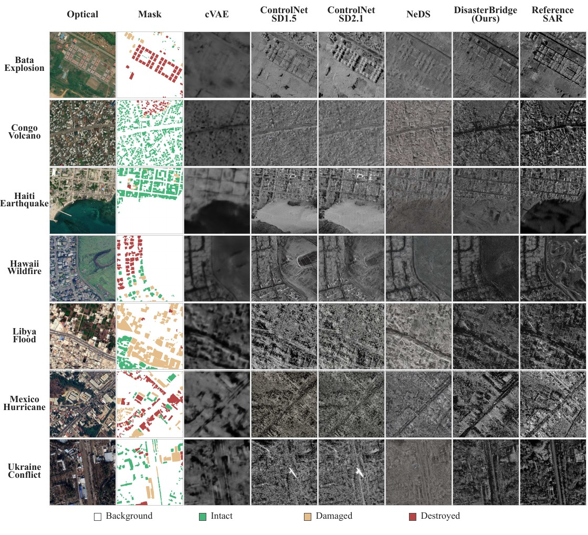

<div align="center">

# DisasterBridge

### Damage-Adaptive Post-Disaster SAR Synthesis via Bridge Diffusion for All-Weather Building Damage Assessment

[](https://www.python.org/)
[](https://pytorch.org/)
[](LICENSE)

</div>

<p align="center">
  
</p>

<p align="center"><em>
DisasterBridge constructs a conditional Brownian bridge in the wavelet-packet space and combines adaptive optical conditioning with disaster–damage modulation.
</em></p>

## Overview

DisasterBridge addresses controllable **pre-disaster optical-to-post-disaster SAR synthesis** for all-weather building damage assessment (BDA). Given a pre-disaster RGB optical image, a target building-damage label map, and a scene-level disaster type, the model generates a single-channel post-disaster SAR image with the prescribed building-damage states and disaster semantics.

The framework contains the three components described in the paper:

- **Frequency-Decoupled Modeling (FDM)** constructs a conditional Brownian bridge in a complete two-level Haar wavelet packet transform (WPT) space. A `1024 × 1024` image is represented by 16 aligned `256 × 256` frequency subbands.
- **Adaptive Optical Conditioning (AOC)** selectively retains reliable structural guidance from the pre-disaster optical image while relaxing optical constraints in damaged and destroyed regions.
- **Disaster–Damage Modulation (DDM)** combines spatially varying building-damage states with scene-level disaster semantics for controllable generation.

### Architecture

| Component | Implementation |
|---|---|
| Complete wavelet-packet representation | Two-level orthonormal Haar WPT recursively decomposes every subband. A grouped `1 × 1` projection independently maps RGB coefficients to one coefficient in each of the 16 optical subbands. |
| Brownian bridge in WPT space | The relaxed optical representation is the source endpoint. The denoiser predicts the bridge residual, and IWPT reconstructs the generated SAR image. |
| Damage-aware endpoint relaxation | Damaged and Destroyed regions are replaced with a standard-normal noise packet; Background and Intact regions retain the optical endpoint. |
| Gated multiscale optical guidance | ResNet18-FPN produces low-, medium-, and high-resolution optical features. Three GCA layers use scaled dot-product cross-attention and inject `G × P(C)` through a residual connection. |
| Local damage modulation | The four-channel damage-indicator map predicts spatially varying affine parameters for group-normalized features at all U-Net scales. |
| Global disaster modulation | The disaster embedding is added to the time condition and predicts channel-wise residual instance-normalization parameters at the bottleneck and decoding stages. |

## Results reported in the paper

### Post-disaster SAR synthesis on the BRIGHT test set

| Method | FID ↓ | FSIM ↑ | PSNR (dB) ↑ |
|---|---:|---:|---:|
| cVAE | 175.840 | 0.4131 | **16.6097** |
| ControlNet (SD 1.5) | 104.560 | 0.6534 | 11.7155 |
| ControlNet (SD 2.1) | 106.570 | 0.6413 | 11.4422 |
| NeDS (SD 2.1) | 114.190 | 0.6298 | 12.1901 |
| **DisasterBridge** | **42.454** | **0.7576** | 15.5525 |

<p align="center">
  
</p>

<p align="center"><em>
Qualitative comparison on the BRIGHT test set. All generators use the same optical image and damage condition within each row.
</em></p>

### Utility for building damage assessment on real SAR

| Experimental setting | Result reported in the paper |
|---|---|
| Generative augmentation | mIoU improves in 7 of 8 BDA model configurations, with a maximum gain of **1.90 percentage points (pp)**. |
| Synthetic pretraining | SAR synthesized from external xView2 optical scenes improves mIoU by up to **2.01 pp** after real-data fine-tuning. |
| Unseen target-region adaptation | Synthetic adaptation improves mIoU by up to **5.76 pp** and Destroyed-class IoU by **11.37 pp**, without real target-domain post-disaster SAR or damage labels for adaptation. |

All downstream evaluations above are performed on real post-disaster SAR observations.

## Installation

Python 3.9 or later is required.

```bash
git clone https://github.com/chunnn26/DisasterBridge.git
cd DisasterBridge

python -m venv .venv
source .venv/bin/activate
pip install -r requirements.txt
```

## Checkpoint

Provide a compatible DisasterBridge checkpoint with `--checkpoint`. The loader accepts a plain PyTorch state dictionary or a dictionary containing `model_state_dict`, `state_dict`, or `model`, and rejects incompatible parameter names or tensor shapes.

Recommended location:

```text
checkpoints/
└── disasterbridge.pth
```

## Inference

The released configuration uses the paper setting of **100 reverse bridge steps with a cosine schedule**.

### Single image

```bash
python inference.py \
  --optical path/to/sample_pre_disaster.tif \
  --mask path/to/sample_building_damage.tif \
  --disaster-type earthquake \
  --checkpoint checkpoints/disasterbridge.pth \
  --output outputs/sample_post_disaster.tif
```

### Directory

```bash
python inference.py \
  --optical path/to/pre-event \
  --mask path/to/damage-maps \
  --disaster-type earthquake \
  --checkpoint checkpoints/disasterbridge.pth \
  --output outputs
```

For directory inference, optical images and damage maps are paired by their base identifier. The suffixes `_pre_disaster` and `_building_damage` are removed before matching. Each generated image is saved as `<identifier>_post_disaster.tif`.

Useful options:

- `--device auto|cpu|cuda|cuda:0` selects the inference device.
- `--seed 2026` controls stochastic generation reproducibly for each sample identifier.
- `--no-amp` disables CUDA automatic mixed precision.

## Input and output format

The optical image and damage map must describe the same spatial extent. Inputs are resized to `1024 × 1024` when necessary. Supported input formats are TIFF, PNG, and JPEG.

The damage map must be a single-channel label image:

| Label | Class |
|---:|---|
| 0 | Background |
| 1 | Intact |
| 2 | Damaged |
| 3 | Destroyed |

The label image is converted directly to the four-channel one-hot condition defined in DDM. No additional boundary channels are appended.

The seven disaster-type conditions used in the paper are:

```text
earthquake, storm, wildfire, flood, volcano, explosion, conflict
```

The output is a single-channel 8-bit TIFF or PNG post-disaster SAR image.

## Repository layout

```text
DisasterBridge/
├── assets/                       # Figures reproduced from the manuscript
├── checkpoints/                  # Checkpoint interface documentation
├── configs/
│   └── disasterbridge.yaml       # Paper inference configuration
├── disasterbridge/
│   ├── bridge.py                 # Reverse Brownian bridge sampler
│   ├── io.py                     # Input, output, and checkpoint utilities
│   ├── model.py                  # DisasterBridge inference model
│   ├── optical_encoder.py        # Multiscale optical encoder
│   ├── unet.py                   # Conditional denoising U-Net
│   └── wavelet.py                # Haar WPT and inverse WPT
├── inference.py                  # Single-image and directory entry point
├── requirements.txt
└── README.md
```

## Data

- **BRIGHT** is available through its [official repository](https://github.com/ChenHongruixuan/BRIGHT) and [Zenodo record](https://doi.org/10.5281/zenodo.14619797).
- The **xBD dataset**, released for the xView2 Challenge, is available through the [official xView2 data portal](https://xview2.org/dataset).

## Citation

```bibtex
@misc{wan2026disasterbridge,
  title  = {DisasterBridge: Damage-Adaptive Post-Disaster SAR Synthesis via Bridge Diffusion for All-Weather Building Damage Assessment},
  author = {Wan, Chunfang and Guo, Haonan and Su, Xin and Zhang, Zaiyan and Zheng, Li and Yuan, Qiangqiang},
  year   = {2026}
}
```

## License

This project is released under the [MIT License](LICENSE).
